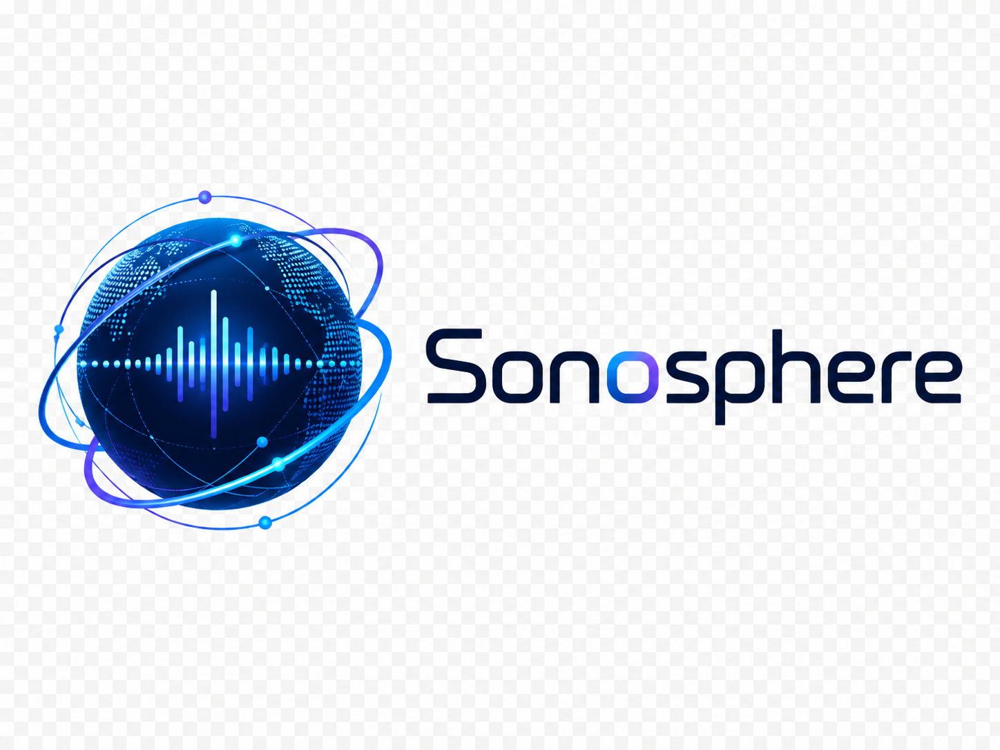

<p align="center">
  
</p>

<p align="center">
  <strong>Play YouTube Music through your Sonos speakers — download once, play forever, no ads.</strong><br/>
  Built with Python + Flask. No Sonos account or API key required. Uses your local network directly.
</p>

---

---

## Features

- **Search YouTube Music** and download tracks to a local library
- **Browse your YouTube Music playlists and Liked Songs** directly in the app
- **Play to any Sonos speaker** on your network — including grouped speakers
- **Real-time audio visualizer** — bars, waveform, or circular modes
- **Queue system** with shuffle, skip, and auto-advance
- **Opens as a standalone window** (no browser tab clutter)
- Songs download once and play instantly forever — no buffering, no ads

## Requirements

- **macOS** (tested on macOS 13+)
- **Python 3.10+** — [download here](https://python.org) if you don't have it
- **Google Chrome** — used to authenticate with YouTube
- **Sonos speaker** on the same Wi-Fi network
- **YouTube account** (free works; Premium gives you better audio quality and no ads)

## Installation

**1. Download the project**

Click the green **Code** button above → **Download ZIP**, then unzip it.

Or if you have git:
```bash
git clone https://github.com/TheJimmyJam/sonosphere.git
```

**2. Double-click `Start Sonosphere.command`**

The first time you run it, it will:
- Create a Python virtual environment
- Install all dependencies automatically
- Ask you to sign in to YouTube once (device code flow — no password entered in the app)
- Open the player window

> **macOS security note:** The first time you double-click the `.command` file, macOS may block it. Right-click it → Open → Open anyway. You'll only need to do this once.

**3. That's it.**

Every time after that, just double-click `Start Sonosphere.command`.

---

## First-time YouTube Setup

When you first launch, the terminal will show something like:

```
Please open https://www.google.com/device and input code ABC-DEF-GHI
Press enter when you have completed this step.
```

Open that URL in Chrome, enter the code, click Allow, then press Enter in the terminal. This authenticates the app with your YouTube account and saves a token locally — you'll never be asked again.

---

## How It Works

1. You search for a song → the app downloads the audio to `~/Music/SonosPlayer/` on your Mac
2. Your Mac serves that audio file over your local network
3. Sonos streams it from your Mac — no internet middleman, no buffering

Your library lives at `~/Music/SonosPlayer/`. Songs are yours to keep.

---

## Usage Tips

- **+ button** on any track adds it to the queue
- **⏮ ⏭** buttons skip through the queue; songs auto-advance when one finishes
- **YouTube Music tab** browses your playlists and Liked Songs directly
- **Bars / Wave / Circle** switches the visualizer mode
- Volume slider syncs with your Sonos speaker in real time

---

## Troubleshooting

**"No Sonos speakers found"**
Make sure your Mac and Sonos are on the same Wi-Fi network. Try the ⟳ refresh button.

**Download fails with 403 error**
The app tries multiple YouTube client methods automatically. If all fail, the video may be region-locked or have special DRM. Try a different version of the same song.

**YouTube Music tab shows an error**
Run through the first-time YouTube Setup above. If you've already done it, try deleting `~/Music/SonosPlayer/oauth_token.json` and restarting to re-authenticate.

**macOS blocked the `.command` file**
Right-click → Open → Open. This is a one-time step for unsigned scripts on macOS.

---

## Tech Stack

- **Flask** — local web server
- **soco** — Sonos control via UPnP (no cloud API)
- **yt-dlp** — YouTube audio download
- **ytmusicapi** — YouTube Music library/playlist access
- **Web Audio API** — real-time frequency analysis for the visualizer
- **Canvas** — visualizer rendering

---

## Disclaimer

This tool downloads audio for personal use on your own network. It is not affiliated with YouTube, Google, or Sonos. Respect copyright and YouTube's Terms of Service. Don't share downloaded files.

---

## Contributing

PRs welcome. Key areas to improve:
- Windows support (the launcher is macOS-only right now)
- Better error handling for edge-case Sonos configurations
- Playlist queue import (add entire YouTube playlist to queue at once)
